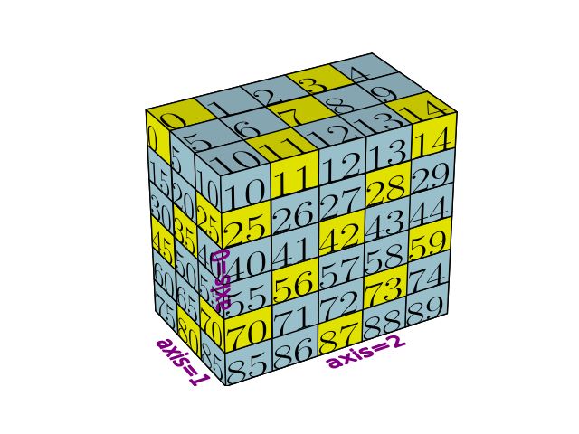
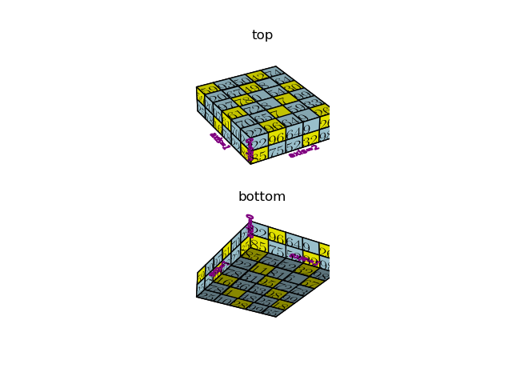
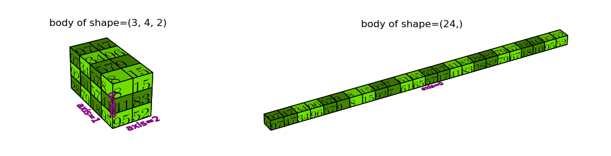
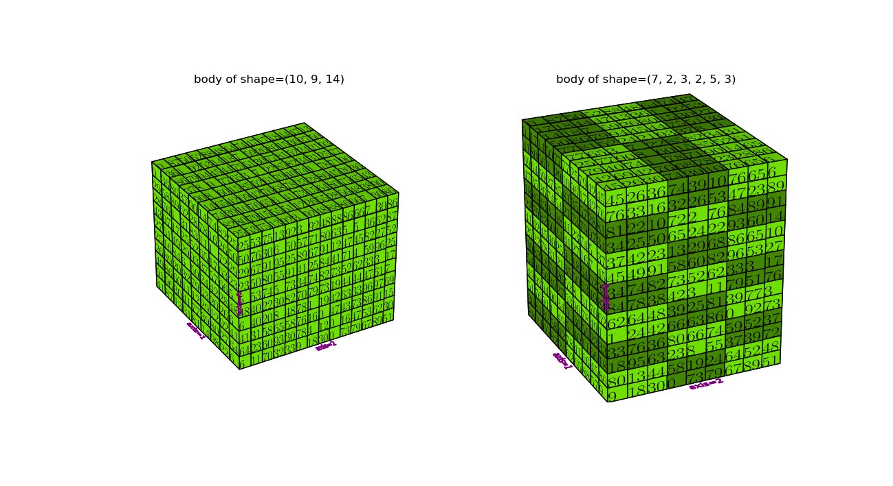
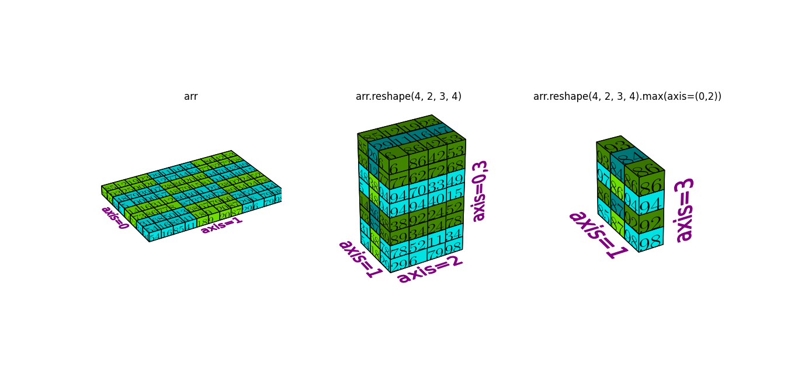
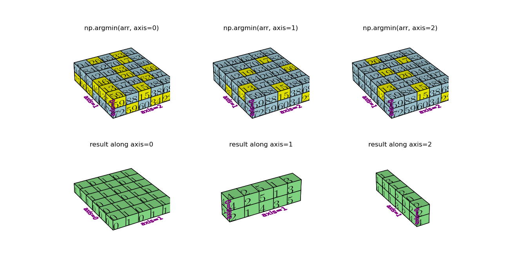
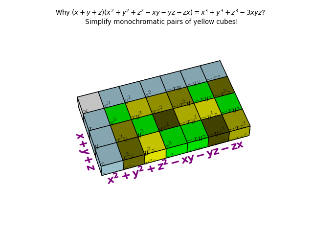
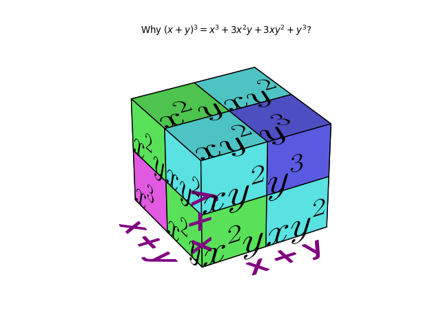

This is a program that helps to visualise methods of `numpy` arrays. 
It is designed to work in 3 dimensions but cal also be extended to no more than 6 dimensions.

### Usage
Import these packages at the beginning of file:

    import numpy as np
    import matplotlib.pyplot as plt
    from numpyviz import VisualArray
    
Every instance of `VisualArray` has an `arr` attribute which is `numpy` array.
It can be visualised after `colors` attribute is assigned.

#### Example 1

    arr = np.arange(90).reshape((6,3,5))
    coords = np.broadcast(*np.indices(arr.shape)) #indices of every cell
    cells = zip(*[c for c in coords if sum(c) % 3 == 0])
    va = VisualArray(arr)
    va.set_colors(cells, color='yellow', basecolor='lightblue')
    va.vizualize(fixview=True)
    plt.show()

#### Example 2

   
    arr = np.random.randint(100, size=60).reshape((2,6,5))
    coords = np.broadcast(*np.indices(arr.shape)) #indices of every cell
    cells = list(zip(*[c for c in coords if sum(c) % 3 == 0]))
    
    fig = plt.figure()
    ax = fig.add_subplot(2, 1, 1, projection='3d')
    ax.set_title('top')
    va = VisualArray(arr, fig=fig, ax=ax)
    va.set_colors(cells, color='yellow', basecolor='lightblue')
    va.vizualize(fixview=True)
    
    ax = fig.add_subplot(2, 1, 2, projection='3d')
    ax.set_title('bottom')
    va = VisualArray(arr, fig=fig, ax=ax)
    va.set_colors(cells, color='yellow', basecolor='lightblue')
    va.vizualize(fixview=True)
    ax.elev = -30
    plt.show()

#### Example 3

    arr = np.random.randint(99, size=1260).reshape((10,9,14))
    shape = (7,2,3,2,5,3)
    
    fig = plt.figure('dimension')
    ax = fig.add_subplot(1, 2, 1, projection='3d')
    ax.set_title(f'body of shape={arr.shape}')
    va = VisualArray(arr, fig=fig, ax=ax)
    va.set_colors(va.get_indices().T, color='lawngreen', basecolor='aqua')
    va.vizualize(fixview=False, axis_labels=('axis=0','axis=1','axis=2'))
    
    ax = fig.add_subplot(1, 2, 2, projection='3d')
    ax.set_title(f'body of shape={shape}')
    va2 = VisualArray(va.arr, va.colors, fig=fig, ax=ax)
    va2.permute(shape)
    va2.vizualize(fixview=True, axis_labels=('axis=0','axis=1','axis=2'))
    plt.get_current_fig_manager().window.state('zoomed')
    ax.azim, ax.elev = -115, 24
    plt.show()
    
#### Example 4

    arr = np.random.randint(99, size=1260).reshape((10,9,14))
    shape = (7,2,3,2,5,3)
    
    fig = plt.figure('dimension')
    ax = fig.add_subplot(1, 2, 1, projection='3d')
    ax.set_title(f'body of shape={arr.shape}')
    va = VisualArray(arr, fig=fig, ax=ax)
    va.set_colors(va.get_indices().T, color='lawngreen', basecolor='aqua')
    va.vizualize(fixview=False, axis_labels=('axis=0','axis=1','axis=2'))
    
    ax = fig.add_subplot(1, 2, 2, projection='3d')
    ax.set_title(f'body of shape={shape}')
    va2 = VisualArray(va.arr, va.colors, fig=fig, ax=ax)
    va2.permute(shape)
    va2.vizualize(fixview=True, axis_labels=('axis=0','axis=1','axis=2'))
    plt.get_current_fig_manager().window.state('zoomed')
    ax.azim, ax.elev = -115, 24
    plt.show()
    
### Example5

    arr = np.random.randint(99, size=96).reshape((1,8,12))
    w = (2, 4)
    
    fig = plt.figure()
    ax = fig.add_subplot(1, 3, 1, projection='3d')
    ax.set_title('image')
    va = VisualArray(arr, fig=fig, ax=ax) #indices of every cell
    cells = va.get_indices_chequerwise(window=(1,)+w)
    va.set_colors(cells.T, color='lawngreen', basecolor='aqua')
    va.vizualize(fixview=True, axis_labels=(None,'axis=1','axis=0'))
    
    ax = fig.add_subplot(1, 3, 2, projection='3d')
    va2 = VisualArray(va.arr, va.colors, fig=fig, ax=ax) #shape: (1, 8, 12)
    shape = (va2.arr.shape[1]//w[0], w[0], va2.arr.shape[2]//w[1], w[1])
    ax.set_title(f'image.reshape{shape}')
    va2.reshape(shape) #shape: (4, 2, 3, 4)
    new_arr, new_colors = va2.arr.copy(), va2.colors.copy()
    va2.permute(shape)
    va2.vizualize(fixview=True, axis_labels=('axis=0','axis=1','axis=2'))
    
    def argmin(arr):
        #bug...
        a2 = arr.argmin(axis=1)
        a4 = arr.argmin(axis=3)
        a1, a3 = np.indices((arr.shape[0], arr.shape[2]))
        x, y, z, t = zip(*np.broadcast(a1, a2, a3, a4))
        return x, y, z, t
    
    ax = fig.add_subplot(1, 3, 3, projection='3d')
    va3 = VisualArray(new_arr, new_colors, fig=fig, ax=ax) #shape: (1, 8, 12)
    ax.set_title(f'image.reshape{shape}.max(axis=(1,3)) \n Not implemented yet')
    ax.axis('off')
    # va3.set_colors(argmin(new_arr), 'yellow')
    #va3.permute(shape)
    #va3.vizualize(fixview=True, axis_labels=('axis=0','axis=1','axis=2'))
    plt.show()
   
### Example 6

    def argmin_axis0(arr):
        a1 = np.argmin(arr, axis=0)
        a2, a3 = np.indices((arr.shape[1], arr.shape[2]))
        x, y, z = zip(*np.broadcast(a1, a2, a3))
        return x,y,z
    
    def argmin_axis1(arr):
        a2 = np.argmin(arr, axis=1)
        a1, a3 = np.indices((arr.shape[0], arr.shape[2]))
        x, y, z = zip(*np.broadcast(a1, a2, a3))
        return x, y, z
    
    def argmin_axis2(arr):
        a3 = np.argmin(arr, axis=2)
        a1, a2 = np.indices((arr.shape[0], arr.shape[1]))
        x, y, z = zip(*np.broadcast(a1, a2, a3))
        return x, y, z
    
    fig = plt.figure()
    arr = np.random.randint(100, size=60).reshape((2,6,5))
    titles = ['np.argmin(arr, axis=0)', 'np.argmin(arr, axis=1)', 'np.argmin(arr, axis=2)']
    result_titles = ['result along axis=0', 'result along axis=1', 'result along axis=2']
    cells = [argmin_axis0(arr), argmin_axis1(arr), argmin_axis2(arr)]
    cell_results = [np.argmin(arr, axis=0)[None,:,:], np.argmin(arr, axis=1)[:,None,:], np.argmin(arr, axis=2)[:,:,None]]
    axis_names = [(None, 'axis=0', 'axis=1'), ('axis=0', None, 'axis=1'), ('axis=0', 'axis=1', None)]
    
    for i in range(3):
        ax = fig.add_subplot(2, 3, 1 + i, projection='3d')
        ax.set_title(titles[i])
        va = VisualArray(arr, fig=fig, ax=ax)
        va.set_colors(cells[i], color='yellow', basecolor='lightblue')
        va.vizualize(fixview=True)
    
    for i in range(3):
        ax = fig.add_subplot(2, 3, 4 + i, projection='3d')
        ax.set_title(result_titles[i])
        va = VisualArray(cell_results[i], fig=fig, ax=ax)
        va.set_colors(basecolor='lightgreen')
        va.vizualize(fixview=True, axis_labels=axis_names[i])
    
    plt.show()

### Example 7

    import matplotlib
    matplotlib.rcParams.update({'font.size': 8})
    arr = np.array([[r'$\times$', r'$x^2$', r'$y^2$', r'$z^2$', r'$-xy$', r'$-yz$', r'$-xz$'],
                    [r'$x$', r'$x^3$', r'$xy^2$', r'$xz^2$', r'$-x^2y$', r'$-xyz$', r'$-x^2z$'],
                    [r'$y$', r'$x^2y$', r'$y^3$', r'$yz^2$', r'$-xy^2$', r'$-y^2z$', r'$-xyz$'],
                    [r'$z$', r'$x^2z$', r'$y^2z$', r'$z^3$', r'$-xyz$', r'$-yz^2$', r'$-xz^2$']])
    va = VisualArray(arr)
    blue = [(0,i,0) for i in range(1,4)] + [(0,0,i) for i in range(1,7)]
    lime = [(0,1,1), (0,2,2), (0,3,3), (0,1,-2), (0,2,-1), (0,3,-3)]
    va.set_colors(zip(*blue), color='lightblue', basecolor='white')
    va.set_colors(zip(*lime), color='lime')
    va.set_colors(zip(*[(0,2,-2), (0,-1,2)]), color='#ffff00')
    va.set_colors(zip(*[(0,1,2), (0,2,4)]), color='#dddd00')
    va.set_colors(zip(*[(0,1,3), (0,-1,-1)]), color='#bbbb00')
    va.set_colors(zip(*[(0,1,4), (0,2,1)]), color='#999900')
    va.set_colors(zip(*[(0,1,6), (0,-1,1)]), color='#777700')
    va.set_colors(zip(*[(0,2,3), (0,-1,-2)]), color='#555500')
    va.vizualize(fixview=True,
                 axis_labels = [None, '$x+y+z$', r'$' + r'\!'*35 + r' x^2+y^2+z^2-xy-yz-zx$'],
                 scale=0.4)
    va.ax.set_title('Why $(x+y+z)(x^2+y^2+z^2-xy-yz-zx) = x^3+y^3+z^3-3xyz$? \n Simplify monochromatic pairs of yellow cubes!')
    va.ax.azim, va.ax.elev = -108, 54
    plt.show()

### Example 8

   
    arr = np.array([[[r'$x^2y$', r'$xy^2$'],[r'$xy^2$', r'$y^3$']],
                    [[r'$x^3$', r'$x^2y$'],[r'$x^2y$', r'$xy^2$']]])
    va = VisualArray(arr)
    va.set_colors(zip(*[(0,1,1)]), color='#6666ff')
    va.set_colors(zip(*[(1,0,0)]), color='#ff66ff')
    va.set_colors(zip(*[(0,0,0),(1,1,0),(1,0,1)]), color='#66ff66')
    va.set_colors(zip(*[(0,1,0),(0,0,1),(1,1,1)]), color='#66ffff')
    va.vizualize(fixview=False,
                 axis_labels = ['$x+y$', '$x+y$', '$x+y$'],
                 scale=0.7)
    va.ax.set_title('Why $(x+y)^3 = x^3+3x^2y+3xy^2+y^3$?')
    plt.show()